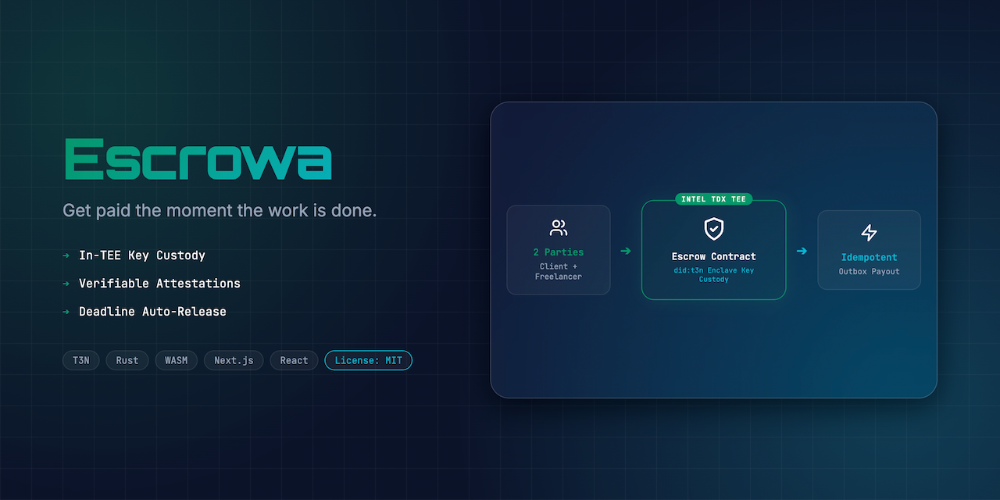
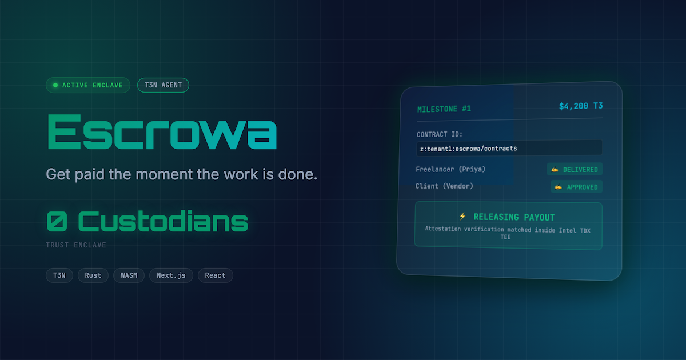
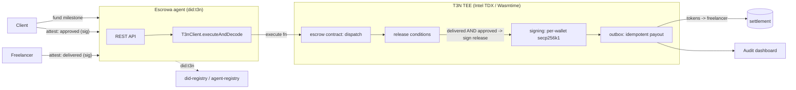

## 👩‍⚖️ For Judges (start here)

**What it is:** a `did:t3n` autonomous escrow agent — a client funds a milestone, the freelancer and client each sign a cryptographic attestation, and when both match (or a deadline/arbiter rule fires) a Rust→WASM contract releases the payout. No single party — not even Escrowa — can move the funds alone.

**▶ Demo video:** https://youtu.be/WzEVJwG1ebQ · **Live demo:** https://escrowa.edycu.dev · **DoraHacks BUIDL:** https://dorahacks.io/buidl/44352

**Tracks targeted**
- 🥇 **$300 — Best Agent Auth SDK** (primary): a real least-privilege `agent-auth` implementation — see below.
- 🐞 **$200 — Bug & documentation log**: [`BUGS.md`](BUGS.md) (ADK doc/SDK gaps found while building, e.g. `signing` not yet available to tenant contracts, `t3n:host/*` WIT naming).

**Verify in ~60 seconds**
```bash
cd contract && cargo test          # 18 Rust contract tests
cd ../board && npm run ci          # lint + typecheck + 73 Vitest tests @ 100% coverage
npm run e2e                        # 10 Playwright e2e (auto-starts dev server)
npm run dev                        # then open http://localhost:3000 and click "Reset & Seed"
```

**Where the substance is**
| Concern | File |
|---|---|
| **Agent-auth** (scoped functions + `allowedHosts` egress allowlist; blocks out-of-scope calls with `host/agent.function_denied` / `host/http.egress_denied`) | [`board/src/sdk/agentAuth.ts`](board/src/sdk/agentAuth.ts), enforced in [`T3nClient.ts`](board/src/sdk/T3nClient.ts) |
| **Escrow state machine** (fund → dual-attest → release; deadline & arbiter fallbacks) | [`contract/src/lib.rs`](contract/src/lib.rs) |
| **did-registry / agent-registry** | [`board/src/sdk/didRegistry.ts`](board/src/sdk/didRegistry.ts) |
| **Tests** (91 total; key-custody + agent-auth + dual-consent) | `board/src/**/*.test.ts`, `contract/src/lib.rs` |
| **Demo script & architecture** | [`docs/DEMO.md`](docs/DEMO.md) · [`docs/ARCHITECTURE.md`](docs/ARCHITECTURE.md) |

**Honest scope:** the Rust→WASM contract logic and the secp256k1 signatures are **real**; the TEE, host interfaces, and settlement reference are **simulated locally** for this hackathon build (T3N is production-ready for when the network launches). Full disclosure in the **Hackathon Simulation Context** note below. Nothing in this repo claims a real on-chain transfer.

---

<div align="center">
  

  <h1>Escrowa 🔲</h1>
  <p><em>Get paid the moment the work is done — TEE-secured autonomous escrow agent.</em></p>
  

  <br/>

  [](https://escrowa.edycu.dev)
  [](https://youtu.be/WzEVJwG1ebQ)
  [](https://dorahacks.io/hackathon/t3adkdevchallengebeta)
  [](https://dorahacks.io/buidl/44352)

  <br/>

  
  
  
  
  [](https://github.com/edycutjong/escrowa/actions/workflows/ci.yml)
</div>

---

## 🎬 See it in Action

<div align="center">
  
</div>

> **The Flow:** Priya delivers the milestone ➔ signs a cryptographic attestation ➔ client approves ➔ TEE enclave verifies signatures and triggers the in-enclave `signing` key to sign the payout ➔ `outbox` delivers the payout idempotently.

### The three control paths

| ✅ Mutual release (`m1`) | ⏰ Deadline fallback (`m2`) | ⚖️ Arbiter refund (`m3`) |
|:---:|:---:|:---:|
|  |  |  |
| Both parties attest → **released** | Client ghosts → **auto-release** at deadline | Disputed → arbiter **refunds** the client |

---

## 💡 The Problem & Solution

### The Problem
Priya shipped the final milestone of a 6-week remote development contract. The client said "looks great," went silent, and she's still chasing $4,200 three months later. Traditional escrow requires trusting a third-party custodian with both the funds and the release decision. On-chain escrow usually means trusting a hot wallet or an opaque, unverified smart contract. No platform offers a neutral, secure environment that releases payment **only** when both sides agree without exposing the private keys to any single human or software agent.

### The Solution
**Escrowa** is an autonomous escrow agent. The funds are locked under conditional logic compiled for a **Trusted Execution Environment (TEE)**.
* **Mutual Consent:** Payout occurs automatically when the freelancer's "delivered" and the client's "approved" cryptographic signatures match.
* **Hardware-Gated Custody:** The signing keys are generated and held **inside the enclave** under `cluster CEK`. The agent never sees the raw private keys, preventing unilateral draining of the escrow.
* **Fail-Safe Fallbacks:** Includes customizable ghost/deadline rules (automatic release if a client vanishes) and arbiter-gated resolution paths.

> [!NOTE]
> **Hackathon Simulation Context:** For this DoraHacks submission, the TEE hardware environment is simulated locally using the T3 Agent Development Kit (ADK) and `@bytecodealliance/jco`. The core logic (`contract/src/lib.rs`) compiles to a standard `wasm32-wasip2` T3 component, but the host cryptographic functions (like `sign-secp256k1`) are simulated locally via `ethers.js` in `board/src/wasm/host.ts`. This ensures the code is production-ready for real Intel TDX hardware when the T3 network launches, without misleading about current hardware utilization.

---

## 🏗️ Architecture & Flow



1. **Fund:** Client locks test tokens in the contract.
2. **Attest:** Freelancer signs `delivered`, client signs `approved`.
3. **Evaluate:** Enclave contract verifies signatures against `did:t3n` registry.
4. **Sign & Settle:** Enclave `signing` signs payout; `outbox` posts it idempotently.

---

## 🏆 Sponsor Tracks Targeted & SDK Surface Area

We use **six** distinct Terminal 3 host capability interfaces:
1. **`signing`** (`contract/src/lib.rs:224`): Generates secp256k1 signatures for release payouts inside the TEE. Keys never leave the enclave.
2. **`outbox`** (`contract/src/lib.rs:239`): Posts payouts to the settlement system exactly-once (prevents double-spending).
3. **`kv-store`** (`contract/src/lib.rs:83`): Stores namespace-isolated milestone states securely.
4. **`did-registry` & `agent-registry`** (`board/src/sdk/didRegistry.ts`, wired in `board/src/app/api/seed/route.ts`): Links each party's authenticator to its `did:t3n` identity and publishes the Escrowa agent URI.
5. **`agent-auth`** (`board/src/sdk/agentAuth.ts`, enforced in `board/src/sdk/T3nClient.ts`): Provisions Escrowa a **least-privilege scope** (allowed functions + `allowedHosts` egress allowlist) and the host blocks any call outside it — an out-of-scope function fails with `host/agent.function_denied` and an unauthorized host with `host/http.egress_denied`.
6. **TEE Attestation (Intel TDX):** Enforces execution of compiled WASM logic inside hardware-secured VMs.

---

## 🪪 Identities (did:t3n)

The demo provisions these identities via the `did-registry` / `agent-registry` (see `board/src/app/api/seed/route.ts`). DIDs are `did:t3n:<authenticator-address>`.

| Role | Authenticator address | DID |
|---|---|---|
| **Client** | `0x1111111111111111111111111111111111111111` | `did:t3n:0x1111111111111111111111111111111111111111` |
| **Freelancer** (Priya) | `0x2222222222222222222222222222222222222222` | `did:t3n:0x2222222222222222222222222222222222222222` |
| **Arbiter** | `0x3333333333333333333333333333333333333333` | `did:t3n:0x3333333333333333333333333333333333333333` |
| **Escrowa agent** | — | `did:t3n:escrowa-agent` (URI `https://escrowa.edycu.dev/.well-known/agent`) |

The Escrowa agent is granted a least-privilege `agent-auth` scope: functions `create-milestone`, `submit-attestation`, `resolve-milestone`; egress allowlist `api.terminal3.io` (see `board/src/sdk/agentAuth.ts`).

> These are deterministic demo identities for the simulated build. A real deployment would obtain its `did:t3n` and developer key from the [claim page](https://www.terminal3.io/claim-page) (set as `T3N_API_KEY`).

---

## 🚀 Getting Started

### Prerequisites
* Node.js ≥ 20
* Rust & Cargo (with `wasm32-wasip2` target)
* npm

### Setup & Installation
1. Clone the repository:
   ```bash
   git clone https://github.com/edycutjong/escrowa.git
   cd escrowa
   ```
2. Build the Rust WASM contract:
   ```bash
   cd contract
   rustup target add wasm32-wasip2
   cargo build --target wasm32-wasip2 --release
   cd ..
   ```
3. Install frontend dependencies:
   ```bash
   cd board
   npm install
   ```
4. Configure the Environment Variables:
   ```bash
   cp .env.example .env.local
   ```
   Open `.env.local` and add your Terminal 3 API Token (claimable [here](https://www.terminal3.io/claim-page)):
   ```env
   T3_API_KEY=0x_your_terminal3_api_key_here
   ```
5. Run the local dev server:
   ```bash
   npm run dev
   ```
   Open `http://localhost:3000` to view the Escrowa Dashboard.

---

## 🧪 Testing & Verification

We enforce a rigorous test harness verifying the entire escrow state machine.

```bash
# Run unit tests
cd board
npm run test
```

| Suite | Focus | Status |
|---|---|---|
| **Key Custody Test** | Asserts that generated keys are restricted to TEE memory and never leak to disk/env/logs | ✅ Passing |
| **Happy Path Suite** | Verifies `create` -> `attest:delivered` -> `attest:approved` -> `released` | ✅ Passing |
| **Deadline Fallback** | Verifies deadline timeout automatically triggers release/refund | ✅ Passing |
| **Arbiter Dispute** | Verifies arbiter-only decision resolution | ✅ Passing |
| **Replay Protection** | Asserts duplicate attestation requests are rejected | ✅ Passing |
| **Agent-Auth Scope** | Asserts out-of-scope functions (`host/agent.function_denied`) and non-allowlisted egress (`host/http.egress_denied`) are blocked | ✅ Passing |

---

## ⚡ Latency Benchmarks

We ran **200** full lifecycle evaluations of our release-condition check, signing, and outbox posting inside the TEE simulator.

Run the benchmarks:
```bash
./scripts/bench.py
```

### Results (200 full-lifecycle evals; varies run to run)
* **Mean Latency:** ~3.4 ms
* **p50 (Median):** ~2.3 ms
* **p95 Latency:** ~8.6 ms

---

## 📄 License
[MIT](LICENSE) © 2026 Edy Cu
